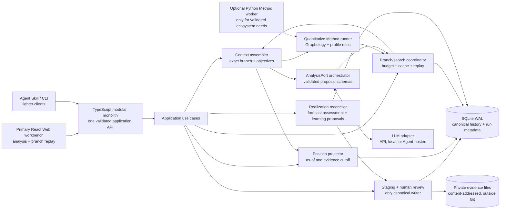

# Architecture and data governance direction

Purpose: describe durable ownership and information-flow boundaries that enable [acceptance](../product/acceptance.md), plus the requirement-rooted runnable v0 direction adopted in [ADR-005](../decisions/README.md#adr-005--llm-analysis-with-framework-owned-state-and-shared-clients). P0-P3 implement the replayable foundation, quantitative Methods, and possibility engine; the P4 design below adds one thin Web route without changing product authority.

```text
authorized sources (read-only)
  -> acquisition / source registry
  -> validation and normalization staging
  -> canonical knowledge + model history
  -> reproducible temporal network / Position projector
  -> branch context + quantitative Methods
  -> provider-neutral LLM analysis
  -> possibility graph + multi-party Evaluation
  -> Web workbench / Agent Skill / CLI
                         ^
                  human correction, branch choice, and judgment
```

## Candidate v0: local-first modular monolith

This direction answers [DW-021](../discovery/direct-wording.md#dw-021--one-runnable-architecture-with-replaceable-parts) under the requirement-root constraint in [DW-022](../discovery/direct-wording.md#dw-022--architecture-must-remain-rooted-in-the-requirement), corrected by [DW-023](../discovery/direct-wording.md#dw-023--configurable-search-scale-and-a-typescript-first-runtime-challenge) and [DW-024](../discovery/direct-wording.md#dw-024--agent-led-analysis-with-framework-owned-branching-and-replay). Every component below exists to complete the first user loop; there are no microservices, graph database, message broker, or large social simulator in v0.

### First runnable user loop

1. Create a local organizational Playground with Parties, Objectives, horizon, and a completely synthetic corpus.
2. Stage text or structured conversation data as immutable Evidence with source identity, time, scope, and hash.
3. Extract candidate Nodes, Utterances, Events, Relations, State, and Claims; a human reviews and accepts or rejects them.
4. Append accepted changes to canonical history, then build a reproducible as-of Position.
5. Run the selected transparent SNA Method pack and assemble an exact branch-specific context containing evidence, current Position, objectives, prior steps, unknowns, and metric results.
6. Let the configured LLM analysis adapter interpret the situation, propose a context-dependent set of Strategy Steps and modeled responses, and explain multi-party Evaluation proposals.
7. Materialize selected resulting Positions in a possibility graph, calculate quantitative features for each, cache the complete run identity, and continue LLM-assisted or policy-assisted exploration until its declared Position/time/token/cost budget is exhausted or the user stops it.
8. Show Main Line and Variations, the network Position at any selected node, before/after changes, score vectors, assumptions, evidence trace, pinned forecasts, and replan triggers in the Web workbench.
9. Return to any historical or hypothetical Position, fork or resume a cached Variation, append a human correction when needed, and replay an earlier cutoff without hindsight or sibling-branch leakage.
10. Add a later realized reaction, append it to Main Line, assess eligible frozen forecasts, review candidate profile-Claim revisions, rebuild the current Position, and retain the old forecast/profile context for replay and calibration.

This is the first proof of StockMesh. A graph picture or chatbot response alone is not.

### Process topology



The Web workbench is the primary human route. Agent Skill and CLI adapters use the same application API for lighter conversational or automated access; they are clients, not separate analysis authorities. No client reads private storage or writes canonical records directly. LLM adapters and Methods can propose Claims, Transitions, Evaluations, and Lines, but only the review/canonical use case can append accepted model history.

### Initial technology slice

| Concern | v0 choice | Why it serves the requirement | Later replacement |
| --- | --- | --- | --- |
| Deployment | One local Node.js modular-monolith process plus static Web assets | One command and one trace/transaction boundary without pretending the browser can safely own private files or native SQLite | Split a worker or shared service only after real concurrency/scale evidence |
| Application core | TypeScript on Node.js with a thin Fastify HTTP host | One language for Domain, branch/replay, Web contracts, Skill/CLI tools, and most initial Methods; Fastify can serve the Vite build in production | Go or another host only after measured CPU, concurrency, distribution, or security needs |
| Persistence | SQLite in WAL mode through `better-sqlite3` and Drizzle migrations | Zero-operator local-first storage with transactions, temporal queries, migrations, and simple backup | PostgreSQL when shared writers, access control, or service deployment is required |
| Evidence bodies | Content-addressed files in a private application-data root | Large/private inputs stay outside Git and outside ordinary database rows; integrity is explicit | Encrypted filesystem or object storage behind `EvidenceStore` |
| Graph analysis | Build a typed, time-bounded in-memory Graphology graph from canonical rows | Transparent MIT-licensed JS/TS algorithms cover the first selected SNA pack without adding a mandatory second runtime | Optional Python worker with NetworkX/CDlib/NDlib; NetworKit/rustworkx for measured compute pressure; AGE only for measured graph-query/storage needs |
| Optional Method worker | No Python process required for the foundation loop; define a narrow worker contract | Retains access to the stronger Python SNA, diffusion, conversation, causal, and statistical ecosystem without making every run operationally polyglot | Activate one validated Method at a time with NetworkX, CDlib, NDlib, ConvoKit, DoWhy, pgmpy, or another reviewed library |
| Web | React + TypeScript + Vite; Cytoscape.js for the board and ECharts for Timeline/score views | Implements the primary workbench, including branch navigation and replay, with mature permissive components | Sigma.js or specialized views behind view-model JSON if graph scale demands it |
| Natural-language analysis | Provider-neutral `AnalysisPort` with validated structured proposals; deterministic/manual fixture remains available for tests | LLM APIs, local models, and Agent-hosted models can perform the same semantic analysis without binding core history to a provider or requiring an autonomous Agent | Replace provider/model or add a routing policy while preserving context, proposal, trace, and cache contracts |
| Agent/CLI access | Thin StockMesh Skill and CLI over the application API | Supports Kimi-like lightweight interaction and automation without duplicating state or analysis semantics | MCP or other transports only when a real client requires them |
| Verification | Vitest for Domain/application/contracts and Playwright for the complete Web loop; worker-specific tests only when Python is activated | Proves reproducibility, cache/replay behavior, and actual user navigation separately | Add load/security/provider-contract suites when a shared or real-data deployment exists |

The foundation choices were checked against official repository license metadata in the [prior-art survey](../discovery/prior-art-survey.md#candidate-v0-foundation-stack-evidence). Listed library licenses are permissive and SQLite is public domain; Node.js reports `NOASSERTION` in repository metadata, so its official license and bundled notices require normal version-level review. Every dependency and transitive lockfile still requires review before implementation.

### Storage and revision model

Use relational canonical tables plus an append-only `change_set` journal, not a hand-built graph database or pure event-sourcing framework:

- Evidence metadata and hashes identify immutable private bodies.
- Accepted Nodes, Relations, Flows, Events, State, Claims, and human judgments have stable IDs, valid/observation time, revision, and source trace.
- A correction appends a superseding revision; it never edits the source or silently rewrites an old analytical run.
- A Position is rebuildable and optionally cached by Playground, profile version, evidence cutoff, as-of time, perspective, and projector version.
- `method_run`, `analysis_run`, Evaluation, candidate Transition, Trajectory, and Recommendation records live in the derived/possibility area with processor identity and inputs.
- Main Line and Variations are parent/child references among Position/Strategy Step records. Every Variation declares forecast, counterfactual, or exploratory purpose and may be pinned, selected for expansion, archived, resumed, or invalidated; none of those states promote it into canonical history.
- A `forecast_assessment` appends a horizon-, rubric-, and coverage-bound many-to-many comparison between frozen forecast Transitions and later realized Events/Transitions. It never edits either side; counterfactual/exploratory branches are not assessed as failed forecasts.
- Realized reactions may produce candidate Claim revisions for a Node/Pawn profile. Only the human-review/reconciliation path may accept them into canonical model history, with valid/observation/record time and the replaced or competing Claim retained.
- Forecast residuals may update separate provider/Method/Search calibration records. Those derived records cannot write Pawn Claims and cannot use forecast text as evidence about the represented world.
- A branch cache identity includes the base Position and evidence cutoff, exact path/context manifest, profile/projector/Method versions, provider/model configuration, Objectives, Evaluation profile, and Search Policy. A changed identity creates or selects a different derived result rather than silently reusing stale analysis.
- Later profile revisions create a new current cache identity but do not invalidate the historical correctness of an old cache at its original cutoff. The UI labels old analyses as historical rather than overwriting or deleting them.
- Checkout/replay never mutates the selected Position. Forking from any historical or hypothetical Position appends another Variation and preserves existing descendants.

SQLite remains the authority in v0. Graphology projections, optional Python graphs, embeddings, branch-analysis caches, search indexes, and UI view models are derived and may be deleted and rebuilt without deleting evidence, canonical history, or attributed human judgment.

### Narrow replacement ports

Only boundaries with a real v0 caller become ports:

| Port | v0 adapter | Replacement examples | Contract that cannot change silently |
| --- | --- | --- | --- |
| `EvidenceStore` | Private content-addressed filesystem | Encrypted store, S3-compatible object store | identity, hash, authorization, retention, body access |
| `CanonicalStore` | SQLite/Drizzle | PostgreSQL; AGE only if graph queries justify it | append/correct transaction, temporal read, provenance, review authority |
| `GraphEngine` | Graphology | Optional NetworkX/CDlib worker, NetworKit, rustworkx, remote graph query | typed question-bounded graph in; attributed Method result out |
| `Method` | Built-in context/metric/profile Methods | ConvoKit, CDlib, NDlib, DoWhy, pgmpy, OASIS/Mesa | method/version, inputs, assumptions, outputs, limitations, uncertainty |
| `AnalysisPort` | Deterministic/manual fixture for tests plus one configured structured-output LLM adapter | Bailian/Qwen-compatible or other cloud API, local model, Agent-hosted model | context manifest, proposal schema, evidence references, provider/model identity, uncertainty, no canonical writes |
| `PossibilityStore` | SQLite derived branch/run records | Separate analytical store when measured | parent/child identity, branch mode/status, cache identity, pin/resume/invalidation, no silent promotion |
| `ForecastMatcher` | Explicit rubric plus optional LLM-assisted candidate matching and human review | Statistical/event matcher or learned evaluator after calibration evidence | frozen forecast identity, realized evidence, horizon, coverage, many-to-many links, status/rationale, no source rewrite |
| `SearchPolicy` | Budgeted LLM-assisted frontier with visible selection rationale | Beam/best-first, MCTS, OpenSpiel experiment, learned policy, external simulator | variable branching, resource budgets, pruning rationale, diversity, per-Party Evaluation, trace |
| `RunExecutor` | In-process persisted run state | Separate worker and durable queue | idempotency, status, retry reason, input/output identity |

Do not wrap every library behind an interface. These ports protect the user's core history, result trace, or a likely measured replacement; ordinary local helpers remain ordinary code.

### v0 Method and search behavior

The first Method pack is deliberately legible and is listed algorithm-by-algorithm in the [selected initial SNA table](../discovery/prior-art-survey.md#selected-initial-social-network-method-pack). It uses typed/time-windowed neighborhood retrieval, weighted in/out degree, components/reachability/shortest paths, density/reciprocity/clustering, betweenness, PageRank, cross-group mixing, temporal deltas, and exploratory Louvain communities. Every result retains its raw metric meaning and caveat; none is a social truth or final strategy score. Independent Cascade and Linear Threshold remain opt-in diffusion experiments rather than default claims.

Natural-language analysis is a separate capability:

1. The framework constructs the exact branch context, evidence cutoff, Objectives, prior steps, unknowns, and quantitative Method results.
2. `AnalysisPort` asks a configured LLM adapter for validated Claims, situation interpretation, candidate Actions/wording, modeled responses, qualitative multi-party Evaluation dimensions, assumptions, uncertainty, and replan triggers. It uses the branch-root profile snapshot and holds Pawn attributes stable unless an explicit hypothetical profile Transition is proposed.
3. The framework validates references and modes, materializes only selected candidate Positions, adds reproducible metrics, and stores analysis provenance. LLM output remains in the knowledge/model or possibility plane until human-reviewed promotion applies.
4. The Web workbench drives this loop directly. Skill/CLI clients invoke the same use cases and may supply interaction context, but no autonomous Agent runtime is required.

Branching factor is an observed property of each expanded Position, not a configuration target. If level `i` has branching factor `b_i`, exhaustive size grows with the products of those factors; StockMesh therefore never claims to enumerate an arbitrary deep tree. A run may set `max_depth`, but also constrains materialized Positions, elapsed time, model tokens, monetary cost, uncertainty, and diversity. Any limit may stop expansion.

The v0 reference policy is a budgeted LLM-assisted frontier: generate a context-dependent candidate set, validate and evaluate materialized Positions, retain user-pinned branches, and choose the next frontier with visible objective/uncertainty/diversity rationale. The coordinator supports cancellation, persisted resume, and cache reuse. Beam/best-first search, iterative deepening, progressive widening, MCTS, OpenSpiel, OASIS, learned policies, and external simulators remain replaceable policy/Method options. Tiny depth/candidate counts may appear in smoke fixtures only; they are not architecture defaults or caps. Every materialized Position receives a per-Party vector Evaluation, while unexpanded possibilities are explicitly unevaluated.

When later reality is reviewed, `ForecastMatcher` compares only eligible
`forecast` branches against the new Main Line under their original horizon and
context. It records match/partial/divergence/expired/unknown assessments and
observation coverage. The same realized reaction separately enters the Claim
review path, where an LLM or Method may propose that the Pawn changed, the prior
estimate was wrong, the behavior was context-specific, constraints changed, or
evidence remains insufficient. Accepted Claim revisions create a new Position;
forecast assessments and calibration remain derived records.

### P3 implementation architecture

The [frozen P3 matrix](../verification/p3-acceptance-matrix.json) narrows this
architecture to one engineering slice. It does not add a Web, Agent/CLI, real
provider availability, private-data, or product-acceptance claim.

### P4 implementation architecture

The [frozen P4 matrix](../verification/p4-acceptance-matrix.json) selects the public synthetic organizational workflow as the first user-visible proof. P4 adds four concrete boundaries and no new semantic authority:

```text
React/Vite workbench
  -> typed HTTP client
  -> thin Fastify route validation
  -> WorkbenchQuery / WorkbenchCommand application use cases
  -> existing StockMeshApp, MethodRunner, SearchCoordinator, PossibilityStore
  -> SQLite canonical and derived stores
```

- `WorkbenchQuery` produces one presentation-safe snapshot for Timeline, Position/network, Node/profile trace, Method provenance, branch graph, comparison, and correction status. It may join canonical and derived rows but cannot mutate either.
- `WorkbenchCommand` exposes only named use cases: stage/review synthetic Evidence, run deterministic analysis/search, pin/checkout/fork/resume/replay a Variation, and apply a reviewed profile revision. It delegates canonical writes to `StockMeshApp`; the HTTP and React layers never issue SQL.
- The local Fastify host owns runtime lifecycle and serves the Vite build in production. Development keeps Vite as a separate asset server with `/api` proxying to the same host; this is tooling separation, not a second backend or analysis service.
- The seeded demo imports the public synthetic fixture through the existing ingestion/review boundary and materializes required Positions/Methods through existing use cases. Tests use isolated in-memory SQLite; the local server uses a Git-ignored runtime database and an explicit reset command.
- Cytoscape.js and ECharts consume view-model JSON only. Profile terminology such as Pawn, stance, or role is supplied as display metadata; universal Node, Relation, Flow, Event, Position, and Claim semantics remain unchanged.
- Command responses return a refreshed snapshot plus an attributable operation result. Invalid identities, illegal state transitions, or stale selections fail closed with a recoverable error; no arbitrary record patch endpoint exists.

P4 deliberately does not add authentication, shared multi-user deployment, live provider credentials, file/screenshot extraction, Skill/CLI transport, private-case ingestion, or autonomous action. Those require later authority and measured need.

#### Module and call boundary

```text
SearchCoordinator
  -> ContextAssembler -> immutable ContextSnapshot
  -> AnalysisPort.analyze(request) -> untrusted structured AnalysisProposal
  -> proposal validator -> retained candidates
  -> PossibilityStore.materialize(candidate + Position + Evaluation) [one transaction]
  -> persisted frontier selection -> repeat, pause, resume, or terminate by budget

ForecastAssessmentService
  -> frozen forecast Variation + reviewed actual Event/Transition
  -> horizon/rubric/ObservationCoverage validation
  -> append-only ForecastAssessment
```

`AnalysisPort` is asynchronous and transport-neutral. The foundation adapter is
deterministic and offline. The configured LLM adapter uses an OpenAI-compatible
structured-output HTTP contract, so a Qwen/Bailian-compatible or other reviewed
endpoint can be supplied through runtime configuration without storing an API
key, endpoint, prompt body, or response in Git. Provider output crosses exactly
one runtime validator before any possibility record is written. The adapter is
never a canonical writer.

The analysis request contains only a frozen `ContextSnapshot`, declared
Objectives and horizon, attributable Method-run references/results, explicit
unknowns, and remaining search budget. The validated response may propose
Actions, modeled responses, complete resulting projections, assumptions,
uncertainty, replan triggers, and qualitative multi-Party Evaluation vectors.
It cannot submit canonical Evidence, Events, Claims, Relations, Flows, States,
or review decisions.

#### Derived storage and identities

Schema v3 adds only derived/possibility tables:

| Record | Identity and invariant |
| --- | --- |
| `context_snapshot` | Hash of Position projection identity, evidence cutoff, ordered branch path, profile snapshot, perspective, Objectives, Method runs, projector version, and manifest. Immutable after insert. |
| `analysis_run` and output | Hash of context plus provider/model/configuration and request schema. Status and measured token/cost usage are explicit; output is retained only after validation. |
| `variation_candidate` | Attributed proposal under one analysis run. It is not a Position until selected and materialized. |
| `variation` | Immutable parent/path, one purpose, frozen root context/profile, horizon, assumptions, and producing run. Pin/archive state may change; purpose and lineage may not. |
| derived `position` + `evaluation` | Inserted with the Variation in one transaction. A materialized Position without Evaluation is invalid. Profile snapshot remains the branch-root snapshot unless an explicit hypothetical profile transition is present. |
| `search_run` + `search_frontier` | Policy/version, root, complete budgets and consumption, visible selection rationale, queued/expanded/pruned state, and pause/completion reason. Persisted state is the resume authority. |
| `cache_record` | Exact identity over context, profile, provider/model/configuration, Methods, Objectives/evaluation profile, and Search Policy. Near matches are misses, never stale reuse. |
| `observation_coverage` + `forecast_assessment` | Append-only actual-versus-frozen-forecast comparison. Only a forecast is eligible; many-to-many references remain explicit. |

Canonical and possibility tables have different permitted writers. The existing
review/application boundary remains the sole canonical writer. P3 services may
read canonical rows and append derived rows; tests snapshot canonical table
counts and contents around successful and rejected analysis runs.

#### Search and replay state machine

```text
running -> paused-budget -> running (resume)
running -> paused-user   -> running (resume)
running -> completed
running -> cancelled
running -> failed
```

The reference policy is a deterministic priority frontier over user pins,
declared objective score, uncertainty, diversity, and stable identity. It is a
replaceable baseline, not a claim that this ordering is universally optimal.
Each expansion asks `AnalysisPort` for a context-dependent candidate set. The
coordinator may retain unexpanded candidates, but only selected candidates
consume the materialized-Position budget and must receive Evaluation.

Every run declares optional `maxDepth`, `maxMaterializedPositions`,
`maxAnalysisCalls`, `maxElapsedMs`, `maxTokens`, and `maxCost`. At least one
finite stopping budget is required. The first exhausted limit pauses the run
with its frontier intact and a reason. Resume applies an explicit additional or
replacement budget envelope; it does not repeat an already succeeded analysis
run or expanded frontier entry. Cancellation is terminal.

Checkout returns the frozen Position, context, lineage, and Evaluation without
writing. Pinning changes preference state only. Forking creates a new search
root whose context path ends at the selected historical or hypothetical
Position; the original parent, descendants, siblings, purpose, and mode remain
unchanged. Replay recomputes identities and fails closed on drift. A separate
hindsight request may use later context, but receives a new identity and label.

#### Forecast assessment rules

Assessment accepts only a `forecast` Variation and reviewed actual or
reconstructed Events/Transitions. `matched`, `partially-matched`, and `diverged`
retain explicit actual references and rubric rationale. `expired-unobserved`
also requires that the forecast horizon elapsed at assessment time and linked
ObservationCoverage is `adequate`; otherwise the only valid non-match outcomes
are `pending` or `unknown`. No assessment updates the Variation, forecast
Position, original probability/rank, root profile/context, actual history, or
subject Claims. Calibration and reviewed profile learning remain later,
separate writers even when they consume the same assessment evidence.

### Requirement trace

| User outcome | Owning component | First proof |
| --- | --- | --- |
| New information joins cumulative context | staging, review, canonical history | one accepted synthetic Utterance changes a reproducible Position |
| See who, what relation, what changed, and why | Position projector + Web workbench | Timeline/network before-after view with evidence links |
| Keep fact, inference, judgment, and prediction separate | canonical status rules + possibility store | trace panel shows each plane and rejects silent promotion |
| Score a situation for several people/forces | profile evaluator | per-Party vector scores with objectives, weights, horizon, and unknowns |
| Infer possible next steps and reactions | AnalysisPort + Method runner + SearchPolicy | provider-traced LLM analysis and a budgeted, resumable branch graph with assumptions, score changes, and replan triggers |
| Learn from what actually happened | canonical review + ForecastMatcher + Claim revision + calibration store | one realized reaction appends Main Line, assesses eligible forecasts, proposes reviewable competing profile revisions, and preserves the old cutoff |
| Learn from macro and micro methods | Method registry | every output names Method/version; disagreements remain visible |
| Revisit an earlier decision honestly | temporal store + Position projector + PossibilityStore | checkout/fork at any Position excludes later or sibling context; pinned forecasts remain hypothetical |
| Use a Web UI plus lightweight Agent/CLI access | one application API + AnalysisPort | Web completes the primary loop; Skill/CLI clients get the same analysis and trace without database access |
| Replace parts without losing the product | narrow ports + canonical contracts | adapter contract tests pass before and after one fake replacement |

### Delivery path

1. **Foundation slice:** schema/migrations, private Evidence staging, human review, canonical history, time-bounded profile Claim revisions, organizational profile, synthetic fixture, and Position build/compare/replay through API tests.
2. **Quantitative Method slice:** Method registry, the selected transparent Graphology SNA pack, temporal deltas, multi-Party score structures, and persisted attributable runs.
3. **Analysis and branch slice:** provider-neutral AnalysisPort, one configured structured-output LLM adapter plus deterministic fixtures, PossibilityStore, branch purpose, budgeted/resumable frontier, pin/fork/cache/replay, per-materialized-Position Evaluation, and cutoff-correct Forecast Assessment.
4. **Workbench slice:** local React UI completes stage -> review -> Position/Timeline -> ask analysis -> explore/pin/fork Variations -> enter realized reaction -> compare forecast/reality -> review profile revisions -> correction/replay.
5. **Client slice:** expose the already-tested application API through the narrow CLI and StockMesh Skill adapter; no new analysis or data authority.
6. **Learning slice:** run synthetic and explicitly authorized pilots, measure errors/latency/usefulness, and replace only the components that fail their acceptance target.

### Upgrade triggers

- Move SQLite to PostgreSQL only when shared writers, multi-user authorization, backup/operations, or measured query behavior requires it.
- Add a worker/queue only when Method runs outlive HTTP requests, need independent scaling, or require durable restart/retry beyond the in-process executor.
- Replace Graphology only when representative projection/analysis benchmarks or missing algorithms fail a target. Activate a Python worker for a named Method rather than making it a second general backend; choose NetworkX/CDlib/NDlib for capability or NetworKit/rustworkx for measured compute pressure.
- Add ConvoKit, causal/probabilistic Methods, learned models, or additional SNA/diffusion algorithms one validated question at a time.
- Replace or route the LLM provider/model only through AnalysisPort and invalidate affected caches when context-window, model, prompt/schema, or evaluation behavior changes.
- Add Mesa/OASIS only when the user needs population-level emergence that the bounded Strategy Step model cannot express.
- Replace the reference frontier policy only when a fixed synthetic benchmark demonstrates a quality/depth/diversity/cost deficit and supplies enough transition evidence for beam, best-first, MCTS, learned, or simulator-backed alternatives.
- Split services only for a real security, ownership, lifecycle, or scaling boundary. Source, canonical history, and derived possibilities do not become separate services merely because they are separate concepts.

## Data classes and permitted writers

| Data class | Authority | Permitted writers | Rule |
| --- | --- | --- | --- |
| Raw source evidence | External source plus immutable local acquisition record | Authorized acquisition boundary only | Append/read-only after capture; preserve identity and integrity |
| Source registry / provenance | Ingestion core | Validating ingestion commands | Every accepted item has stable source, time, scope and hash/identity evidence |
| Canonical Claims and modeled objects | Knowledge/model core | Validated reconciliation commands | LLM/Method adapters never write directly; epistemic status and temporal validity are explicit |
| Canonical Events, States, Relations and Flows | Temporal network core | Validated ingestion/reconciliation commands | Append/correct through traceable revisions; Positions never rewrite modeled history |
| Human judgments and corrections | Human-review record | Authorized human-review workflow | Append attributed decisions; do not rewrite source evidence |
| Positions, indexes, embeddings and views | Projection/derivation pipeline | Rebuildable processors | Bound to as-of time, evidence scope, perspective, and processor identity; deletable/rebuildable |
| Evaluations, possible Trajectories, branch preferences and recommendations | Analysis/Possibility run store | Validated AnalysisPort, Method, search, and user-preference use cases | Derived and advisory; retain context/cache identity, provider/model, Methods, weights, assumptions, uncertainty, mode, and lineage |
| Forecast Assessments and model/Method/Search calibration | Forecast evaluation store | Validated ForecastMatcher/calibration use cases after realized evidence review | Derived; preserve frozen forecast, actual evidence, rubric, horizon, coverage, status, residual, and assessor; never write profile Claims directly |
| Runtime state and logs | Runtime boundary | Runtime services | Kept outside Git and separated from product evidence |
| Credentials and access policy | Secret/config boundary | Authorized operators | Never placed in source data, prompts, ordinary logs, or Git |
| Private source locators and case mapping | Private evidence boundary outside Git | Authorized acquisition/review workflow | Never published; public derivatives use non-linkable safe identities |

## Stable conceptual model

The product-level meanings are owned by the [candidate domain model](../product/domain-model.md). Architecture preserves four distinct planes: external world, source knowledge, accepted model, and possibilities. Its stable storage/processing boundary recognizes Evidence and Claims; Playground, Node, Relation, Flow, State, Event, Mechanism, Transition, Position, Timeline, Perspective, Evaluation, optional Action, and Trajectory.

Profiles own concepts such as person, statement, stance, trust, energy, organism, task, and orbit. `Pawn`, `Move`, `Line`, and `Game Record` are optional strategy-workbench aliases or views, not storage-layer assumptions.

`Utterance` is a communication-profile object. `Strategy Step` is a rebuildable
view joining a contextual input to its before/after Position and Transition; it
does not become a second canonical event log. The Git/state-machine analogy
governs revision, parent/child, branch, and replay semantics without selecting a
runtime implementation.

Reasoning Methods are replaceable derived processors above the evidence,
knowledge, and Position layers. Macro and micro Methods may compose or disagree,
but each result retains method/version, inputs, assumptions, scope, and
uncertainty. A Method may use profile Mechanisms without rewriting them or the
evidence it analyzed. This boundary deliberately leaves rules, retrieval,
graph/statistical/learned analysis, and search algorithms open.

## Key invariants

- Raw evidence is never rewritten to make the graph cleaner.
- LLM/provider output is untrusted staging or a derived proposal until validated by the owning boundary.
- Canonical records retain uncertainty, contradiction, time, and provenance.
- Derived material is rebuildable and cannot delete or alter authoritative input.
- The universal core does not assume personhood, agency, communication, conservation, or a company. Domain-specific semantics remain in explicit profiles.
- Relation and Flow remain distinct; Position is a reproducible projection rather than a second word for stance or an authoritative world snapshot.
- Case-derived learning crosses into the public repository only as generalized product authority, synthetic material, or an explicitly authorized and reviewed de-identified template.
- Web, Agent Skill, and CLI clients interact through validated capabilities; none reads private databases or writes canonical data directly.
- Position evaluation is vector-first and objective-bound. Scalar ranking is a derived view with inspectable weights.
- Scenario search preserves branch diversity and uncertainty; greater depth does not imply greater truth.
- Actual/reconstructed and hypothetical/predicted Trajectories remain distinct. An eligible forecast may receive append-only assessments against later evidence but is never rewritten into historical fact.
- Branch purpose and realization status are orthogonal: an earlier forecast may later match reality, while counterfactual/exploratory branches carry no realization claim.
- Pinning, checking out, resuming, or forking a Variation changes only derived branch/preference state; existing parents and siblings remain intact.
- Cache reuse requires an exact declared context/processor/policy identity; stale analysis is invalidated or visibly superseded rather than silently reused.
- Realized reactions can revise profile Claims only through append-only evidence/review. Forecast residuals calibrate models/Methods/Search separately and never become subject evidence by themselves.
- An expired-unobserved outcome requires elapsed horizon plus adequate observation coverage; silence otherwise remains unknown.

## Open architecture decisions

- Graph database versus relational/event storage versus hybrid, based on the first validated queries.
- Local-first versus shared service boundary, based on data authority and collaboration needs.
- Identity-resolution and temporal-logic approach.
- Exact provider/model route, structured-analysis schema, prompt/evaluation policy, and first optional Python Method worker.
- Privacy, access, retention, redaction, and audit model for a real company pilot.

These remain candidates. No framework, language, database, or model provider is adopted at repository init.
