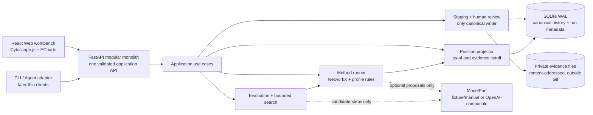

# Architecture and data governance direction

Purpose: describe durable ownership and information-flow boundaries that enable [acceptance](../product/acceptance.md), plus one requirement-rooted runnable v0 candidate. The candidate is reviewable and replaceable; it is not an adopted implementation until the user accepts it.

```text
authorized sources (read-only)
  -> acquisition / source registry
  -> validation and normalization staging
  -> canonical knowledge + model history
  -> reproducible temporal network / Position projector
  -> evaluation + scenario engine
  -> Web workbench / external Agent contract
                    ^
             human correction and judgment
```

## Candidate v0: local-first modular monolith

This candidate answers [DW-021](../discovery/direct-wording.md#dw-021--one-runnable-architecture-with-replaceable-parts) under the requirement-root constraint in [DW-022](../discovery/direct-wording.md#dw-022--architecture-must-remain-rooted-in-the-requirement). Every component below exists to complete the first user loop; there are no microservices, graph database, message broker, or large social simulator in v0.

### First runnable user loop

1. Create a local organizational Playground with Parties, Objectives, horizon, and a completely synthetic corpus.
2. Stage text or structured conversation data as immutable Evidence with source identity, time, scope, and hash.
3. Extract candidate Nodes, Utterances, Events, Relations, State, and Claims; a human reviews and accepts or rejects them.
4. Append accepted changes to canonical history, then build a reproducible as-of Position.
5. Run a small Method pack over that Position: temporal/graph context retrieval, transparent network metrics, and profile scoring.
6. Generate human-, template-, or optional model-proposed Strategy Steps; search two plies with a small diverse beam and evaluate every reachable Position for every declared Party.
7. Show the Timeline, network Position, before/after changes, score vectors, three alternative Lines, assumptions, evidence trace, and replan triggers in the Web workbench.
8. Append a human correction, rebuild the affected Position and runs, and replay the earlier cutoff without hindsight leakage.

This is the first proof of StockMesh. A graph picture or chatbot response alone is not.

### Process topology



The Web workbench and future Skill use the same application API. No client reads private storage or writes canonical records directly. Methods and models can propose Claims, Transitions, scores, and Lines, but only the review/canonical use case can append accepted model history.

### Initial technology slice

| Concern | v0 choice | Why it serves the requirement | Later replacement |
| --- | --- | --- | --- |
| Deployment | One local modular-monolith process plus static Web assets | Lowest operational cost; preserves one transaction and trace boundary | Split a worker or shared service only after real concurrency/scale evidence |
| Backend | Python, FastAPI, Pydantic | Direct access to the permissive analysis ecosystem; typed HTTP and generated schemas for Web/Agent clients | Domain/application modules remain framework-light; another transport can call the same use cases |
| Persistence | SQLite in WAL mode through SQLAlchemy and Alembic | Zero-operator local-first storage with transactions, temporal queries, migrations, and simple backup | PostgreSQL when shared writers, access control, or service deployment is required |
| Evidence bodies | Content-addressed files in a private application-data root | Large/private inputs stay outside Git and outside ordinary database rows; integrity is explicit | Encrypted filesystem or object storage behind `EvidenceStore` |
| Graph analysis | Build a question-bounded in-memory NetworkX graph from canonical rows | Correctness-first, BSD-3-Clause, broad SNA methods, no premature graph database | NetworKit/rustworkx for measured compute pressure; Apache AGE for measured graph-query/storage needs |
| Web | React + TypeScript + Vite; Cytoscape.js for the board and ECharts for Timeline/score views | Implements the required workbench with mature permissive components | Sigma.js/Graphology or specialized views behind view-model JSON if graph scale demands it |
| Model use | Optional provider-neutral `ModelPort`; deterministic fixture/manual adapter is always available | The core loop, tests, and provenance do not depend on a vendor or secret | Any local/cloud model that returns the validated proposal schema |
| Verification | pytest for domain/API and Playwright for the complete workbench loop | Proves reproducibility and actual user navigation separately | Add load/security suites when a shared or real-data deployment exists |

The foundation choices were checked against official repository license metadata in the [prior-art survey](../discovery/prior-art-survey.md#candidate-v0-foundation-stack-evidence). All are permissive or, for SQLite, public domain; transitive dependencies still require a lockfile-level review before implementation.

### Storage and revision model

Use relational canonical tables plus an append-only `change_set` journal, not a hand-built graph database or pure event-sourcing framework:

- Evidence metadata and hashes identify immutable private bodies.
- Accepted Nodes, Relations, Flows, Events, State, Claims, and human judgments have stable IDs, valid/observation time, revision, and source trace.
- A correction appends a superseding revision; it never edits the source or silently rewrites an old analytical run.
- A Position is rebuildable and optionally cached by Playground, profile version, evidence cutoff, as-of time, perspective, and projector version.
- `method_run`, Evaluation, candidate Transition, Trajectory, and Recommendation records live in the derived/possibility area with processor identity and inputs.
- Main Line and Variations are parent/child references among Position/Strategy Step records. Predicted branches never enter canonical history merely because they were later selected.

SQLite remains the authority in v0. NetworkX graphs, embeddings, search trees, and UI view models are derived caches and may be deleted and rebuilt.

### Narrow replacement ports

Only boundaries with a real v0 caller become ports:

| Port | v0 adapter | Replacement examples | Contract that cannot change silently |
| --- | --- | --- | --- |
| `EvidenceStore` | Private content-addressed filesystem | Encrypted store, S3-compatible object store | identity, hash, authorization, retention, body access |
| `CanonicalStore` | SQLite/SQLAlchemy | PostgreSQL; AGE only if graph queries justify it | append/correct transaction, temporal read, provenance, review authority |
| `GraphEngine` | NetworkX | NetworKit, rustworkx, remote graph query | typed question-bounded graph in; attributed Method result out |
| `Method` | Built-in context/metric/profile Methods | ConvoKit, CDlib, NDlib, DoWhy, pgmpy, OASIS/Mesa | method/version, inputs, assumptions, outputs, limitations, uncertainty |
| `ModelPort` | Deterministic/manual fixture; optional OpenAI-compatible HTTP | Local or cloud model/provider | proposal schema, evidence references, model identity, no canonical writes |
| `SearchPolicy` | Diverse beam, depth 2 and width 3 defaults | OpenSpiel experiment, MCTS, learned policy, external simulator | branch budget, pruning rationale, diversity, per-Party Evaluation, trace |
| `RunExecutor` | In-process persisted run state | Separate worker and durable queue | idempotency, status, retry reason, input/output identity |

Do not wrap every library behind an interface. These ports protect the user's core history, result trace, or a likely measured replacement; ordinary local helpers remain ordinary code.

### v0 Method and search behavior

The first Method pack is deliberately legible:

1. Temporal and graph-neighborhood context retrieval.
2. NetworkX structural metrics such as degree, betweenness, components, and shortest paths, each labeled as a metric rather than social truth.
3. Organizational-profile rules that emit vector dimensions such as support, information, relationship effect, risk, reversibility, and cost, including unknowns and evidence confidence.
4. Optional model proposals for extraction, candidate wording, and likely responses; validation turns them into hypotheses, never observations.

The initial `SearchPolicy` uses a diverse beam because it is simple to inspect and works without calibrated transition probabilities. Defaults are depth 2, width 3, and at least three materially different Lines when available. The policy is a replaceable v0 choice, not the StockMesh definition. Monte Carlo, OpenSpiel, OASIS, or learned policies enter only after a synthetic benchmark shows what the simple baseline cannot do.

### Requirement trace

| User outcome | Owning component | First proof |
| --- | --- | --- |
| New information joins cumulative context | staging, review, canonical history | one accepted synthetic Utterance changes a reproducible Position |
| See who, what relation, what changed, and why | Position projector + Web workbench | Timeline/network before-after view with evidence links |
| Keep fact, inference, judgment, and prediction separate | canonical status rules + possibility store | trace panel shows each plane and rejects silent promotion |
| Score a situation for several people/forces | profile evaluator | per-Party vector scores with objectives, weights, horizon, and unknowns |
| Infer possible next steps and reactions | Method runner + SearchPolicy | three two-ply Lines with assumptions, score changes, and replan triggers |
| Learn from macro and micro methods | Method registry | every output names Method/version; disagreements remain visible |
| Revisit an earlier decision honestly | temporal store + Position projector | replay at old cutoff excludes later Evidence and labels hindsight separately |
| Use a Web UI and later external Agents | one application API | Web completes the loop; thin client gets the same trace without database access |
| Replace parts without losing the product | narrow ports + canonical contracts | adapter contract tests pass before and after one fake replacement |

### Delivery path

1. **Foundation slice:** schema/migrations, private Evidence staging, human review, canonical history, organizational profile, synthetic fixture, and Position build/compare/replay through API tests.
2. **Strategy slice:** Method registry, NetworkX metrics, transparent multi-Party score vectors, persisted runs, and diverse depth-2 search returning three Lines.
3. **Workbench slice:** local React UI completes stage -> review -> Position/Timeline -> analysis -> compare Lines -> trace -> correction/replay.
4. **Agent slice:** expose the already-tested application API through the narrow CLI/Skill or MCP adapter; no new data authority.
5. **Learning slice:** run synthetic and explicitly authorized pilots, measure errors/latency/usefulness, and replace only the components that fail their acceptance target.

### Upgrade triggers

- Move SQLite to PostgreSQL only when shared writers, multi-user authorization, backup/operations, or measured query behavior requires it.
- Add a worker/queue only when Method runs outlive HTTP requests, need independent scaling, or require durable restart/retry beyond the in-process executor.
- Replace NetworkX only when representative projection/analysis benchmarks fail their target; choose NetworKit/rustworkx for compute or AGE for query/storage, not all three.
- Add ConvoKit, CDlib, NDlib, causal/probabilistic Methods, or learned models one validated question at a time.
- Add Mesa/OASIS only when the user needs population-level emergence that the bounded Strategy Step model cannot express.
- Replace beam search only when a fixed synthetic benchmark demonstrates a quality/depth/diversity deficit and supplies enough transition evidence for the alternative.
- Split services only for a real security, ownership, lifecycle, or scaling boundary. Source, canonical history, and derived possibilities do not become separate services merely because they are separate concepts.

## Data classes and permitted writers

| Data class | Authority | Permitted writers | Rule |
| --- | --- | --- | --- |
| Raw source evidence | External source plus immutable local acquisition record | Authorized acquisition boundary only | Append/read-only after capture; preserve identity and integrity |
| Source registry / provenance | Ingestion core | Validating ingestion commands | Every accepted item has stable source, time, scope and hash/identity evidence |
| Canonical Claims and modeled objects | Knowledge/model core | Validated reconciliation commands | Model adapters never write directly; epistemic status and temporal validity are explicit |
| Canonical Events, States, Relations and Flows | Temporal network core | Validated ingestion/reconciliation commands | Append/correct through traceable revisions; Positions never rewrite modeled history |
| Human judgments and corrections | Human-review record | Authorized human-review workflow | Append attributed decisions; do not rewrite source evidence |
| Positions, indexes, embeddings and views | Projection/derivation pipeline | Rebuildable processors | Bound to as-of time, evidence scope, perspective, and processor identity; deletable/rebuildable |
| Evaluations, possible Trajectories and recommendations | Analysis run store | Evaluation/simulation engine after input validation | Derived and advisory; retain model, weights, assumptions, uncertainty, and lineage |
| Runtime state and logs | Runtime boundary | Runtime services | Kept outside Git and separated from product evidence |
| Credentials and access policy | Secret/config boundary | Authorized operators | Never placed in source data, prompts, ordinary logs, or Git |
| Private source locators and case mapping | Private evidence boundary outside Git | Authorized acquisition/review workflow | Never published; public derivatives use non-linkable safe identities |

## Stable conceptual model

The product-level meanings are owned by the [candidate domain model](../product/domain-model.md). Architecture preserves four distinct planes: external world, source knowledge, accepted model, and possibilities. Its stable storage/processing boundary recognizes Evidence and Claims; Playground, Node, Relation, Flow, State, Event, Mechanism, Transition, Position, Timeline, Perspective, Evaluation, optional Action, and Trajectory.

Profiles own concepts such as person, statement, stance, trust, energy, organism, task, and orbit. `Pawn`, `Move`, `Line`, and `Game Record` are optional strategy-workbench aliases or views, not storage-layer assumptions.

`Utterance` is a communication-profile object. `Strategy Step` is a rebuildable
view joining a contextual input to its before/after Position and Transition; it
does not become a second canonical event log. The Git/state-machine analogy
governs revision, parent/child, branch, and replay semantics without selecting a
runtime implementation.

Reasoning Methods are replaceable derived processors above the evidence,
knowledge, and Position layers. Macro and micro Methods may compose or disagree,
but each result retains method/version, inputs, assumptions, scope, and
uncertainty. A Method may use profile Mechanisms without rewriting them or the
evidence it analyzed. This boundary deliberately leaves rules, retrieval,
graph/statistical/learned analysis, and search algorithms open.

## Key invariants

- Raw evidence is never rewritten to make the graph cleaner.
- Model output is untrusted staging until validated by the owning boundary.
- Canonical records retain uncertainty, contradiction, time, and provenance.
- Derived material is rebuildable and cannot delete or alter authoritative input.
- The universal core does not assume personhood, agency, communication, conservation, or a company. Domain-specific semantics remain in explicit profiles.
- Relation and Flow remain distinct; Position is a reproducible projection rather than a second word for stance or an authoritative world snapshot.
- Case-derived learning crosses into the public repository only as generalized product authority, synthetic material, or an explicitly authorized and reviewed de-identified template.
- External Agents interact through validated capabilities; they do not read private databases or write canonical data directly.
- Position evaluation is vector-first and objective-bound. Scalar ranking is a derived view with inspectable weights.
- Scenario search preserves branch diversity and uncertainty; greater depth does not imply greater truth.
- Actual/reconstructed and hypothetical/predicted Trajectories remain distinct. An optional Variation can be linked to later confirming evidence but never rewritten into historical fact.

## Open architecture decisions

- Graph database versus relational/event storage versus hybrid, based on the first validated queries.
- Local-first versus shared service boundary, based on data authority and collaboration needs.
- Identity-resolution and temporal-logic approach.
- Retrieval, network metrics, stance analysis, and language-model responsibilities.
- Privacy, access, retention, redaction, and audit model for a real company pilot.

These remain candidates. No framework, language, database, or model provider is adopted at repository init.
