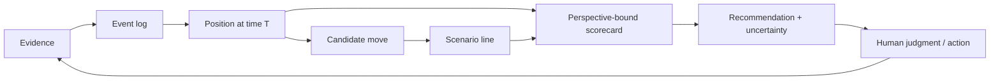

# Candidate domain model — Playground, Pawn, Position, Line

Status: **candidate for user review**. This document interprets [DW-006](../discovery/direct-wording.md#dw-006--chess-like-domain-simulation-ui-and-agent-interface); it is not yet an adopted implementation contract.

Purpose: give StockMesh a domain language that works first for company networks but can later represent other social, organizational, resource, biological, or machine networks.

## The core loop



The stable idea is:

```text
Position(t) = project(authorized events up to t, selected perspective)
Next position = transition(current position, candidate move, modeled responses)
Advice = compare scenario lines under an explicit objective, horizon, and risk policy
```

The event log stays authoritative. A position is a reproducible projection, not a replacement for history. Historical influence may be summarized into position features while remaining traceable to the underlying events.

## Domain vocabulary

| Concept | Meaning | Examples |
| --- | --- | --- |
| **Playground** | A bounded analysis universe with its ontology, participants, permitted evidence, policies, and time range | One project, one company episode, an industry network |
| **Pawn** | A typed analysis node; not necessarily a person | Person, team, company, institution, resource, AI agent |
| **Scene** | The active setting in which interaction occurs | WeChat group, video call, meeting room, R&D site, sales site |
| **Event** | An immutable, time-indexed observation or attributed report of change | Someone joins, speaks, changes role, creates a group, makes a decision |
| **Position** | An immutable view of the relevant state at a chosen time | Present actors, roles, relationships, topic, channel, open commitments, inferred atmosphere |
| **Move** | An actual or candidate intervention | Say a sentence, ask a question, wait, escalate, invite someone, publish a report |
| **Scorecard** | A perspective-bound vector evaluation of a position or line | Goal progress, trust risk, escalation risk, information gain, cost |
| **Line** | One simulated sequence of moves, responses, and resulting positions | “Say X → B resists → C aligns → decision delayed” |
| **Recommendation** | A ranked set of lines with assumptions, evidence, uncertainty, and stop conditions | Best current option under a named objective and horizon |

`Pawn` is the compact domain term. Human-facing UI should default to neutral labels such as “参与者” or “节点” when the chess metaphor would feel dehumanizing.

## Pawn model

A Pawn has a stable identity record and time-bounded facets:

```text
Pawn
  identity: type, aliases, memberships
  role: formal position, decision authority, responsibility
  capability: demonstrated or reported abilities
  style: observed interaction patterns
  stance: topic-specific, time-bounded expressed or inferred position
  state: current availability, pressure, attention, commitments
  relationships: typed, directional, temporal links to other Pawns
```

Personality, motives, competence, loyalty, atmosphere, and predicted behavior are never bare attributes. Each value is an **Assertion** carrying:

- assertion kind: observation, attributed report, model hypothesis, or human judgment;
- evidence references and observer/source;
- valid time and observation time;
- confidence and competing assertions;
- sensitivity and visibility scope;
- processor identity when derived.

This lets the model say “often avoids public conflict in the observed sample” without converting it into “is conflict-avoidant” as timeless fact.

## Event and time model

Minimum event families:

- presence: enter, leave, return, unavailable;
- membership: group created, member added/removed;
- role and authority: assigned, delegated, superseded;
- relationship: cooperation, conflict, dependency, trust signal;
- communication: statement, reply, silence-after-request, commitment;
- task and decision: requested, accepted, rejected, delayed, completed;
- context: channel, physical scene, topic, audience, confidentiality;
- resource: capacity, information, budget, access, dependency change;
- correction: identity merge/split, evidence challenge, human override.

Every event distinguishes when it happened, when it was observed, and—when applicable—the interval for which it is believed valid. Silence, atmosphere, stance change, and motive are interpretations derived from events, not raw events by default.

## Position model

A Position answers “what matters now?” for a selected Playground, time, question, and perspective:

- active Pawns and current Scene;
- formal roles and effective influence;
- visible relationships and dependencies;
- current topic, decisions, commitments, and unresolved tensions;
- known information and likely information asymmetry;
- recent and historically important events;
- expressed stances versus inferred stances;
- inferred atmosphere and pressure with evidence and uncertainty;
- currently available moves and constraints.

Two users may obtain different projections of the same event log because their authorized evidence or decision perspective differs. The position identity therefore includes source scope, projection version, as-of time, and perspective.

## Evaluation model

There is no universal “good position” score. Every evaluation names:

- whose perspective is being evaluated;
- the intended objective and unacceptable outcomes;
- time horizon: hours, days, months, quarters, or years;
- risk tolerance and uncertainty policy;
- evidence cutoff and model version.

The default output is a vector, not one magic number:

| Dimension | Question |
| --- | --- |
| Goal progress | Does this move advance the declared outcome? |
| Relationship effect | What trust, alignment, or conflict may change? |
| Authority fit | Does it respect or deliberately challenge the decision structure? |
| Information gain | Does it reveal useful information or reduce ambiguity? |
| Escalation risk | Could it widen conflict or create irreversible exposure? |
| Reversibility | Can the move be corrected if assumptions are wrong? |
| Resource cost | What time, attention, political capital, or material resource is consumed? |
| Robustness | Does the line remain acceptable across plausible responses? |

A scalar ranking may be derived for a named evaluation profile, but the vector and weighting must remain inspectable.

## Scenario and prediction model

A Line alternates candidate moves and modeled responses:

```text
P0 -> move A -> response hypothesis -> P1 -> move B -> ... -> Pn
```

Each transition records probability or qualitative likelihood, assumptions, causal rationale, counter-signals, scorecard, and a stop/replan condition. “Best line” means best under the declared model and assumptions—not a guaranteed or objectively optimal future.

StockMesh should support multi-party branching and configurable horizons. Ten or twenty steps are a search budget target, not a promise that long social chains are predictable. Search may use pruning, beam width, scenario diversity, and uncertainty thresholds. The product focuses on strategic horizons from hours to years; second-level micro-behavior stays with the human operator.

## Decision replay

Replay reconstructs the information available at an earlier time, compares the move actually taken with plausible alternatives, and explains which later evidence changed the assessment. It must not leak hindsight into the reconstructed position unless the user explicitly enables a hindsight view.

## Candidate MVP domain slice

One private Playground, persons and teams as Pawn types, text/table/image evidence staged outside Git, an immutable event timeline, position snapshots, a configurable scorecard, three diverse scenario lines of limited depth, and a human-selected recommendation. Other Pawn types and deep 10–20 step search remain compatible extensions rather than first-release claims.

## Decisions for user review

1. Keep `Playground / Pawn / Position / Move / Line` as the public domain vocabulary, or use Chinese-first terms in the product surface?
2. Should a Playground represent one case/episode, one organization, or a reusable world containing many episodes?
3. Which scorecard dimensions matter most for the first company workflow?
4. Should human-authored judgments be able to become canonical immediately, or enter the same review flow as Agent hypotheses?
5. What maximum prediction depth is useful before uncertainty makes additional steps misleading?

