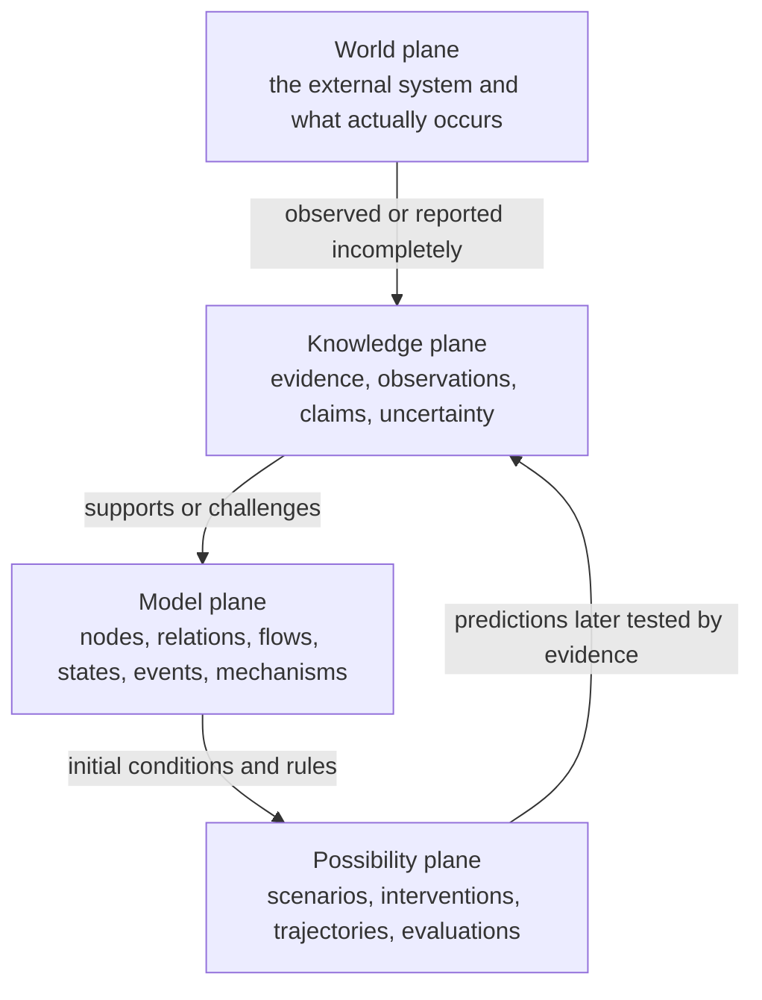

# Candidate universal domain model

Status: **adopted semantic direction; candidate domain refinement**. This document interprets the broad network-analysis requirement in [DW-001](../discovery/direct-wording.md#dw-001--initial-stockmesh-brief) and [DW-006](../discovery/direct-wording.md#dw-006--chess-like-domain-simulation-ui-and-agent-interface), subject to the requirements-first corrections in [DW-010](../discovery/direct-wording.md#dw-010--requirements-first-not-case-first) and [DW-011](../discovery/direct-wording.md#dw-011--domain-before-data-and-business-validation), adopted direction [ADR-003](../decisions/README.md#adr-003--requirements-rooted-domain-direction), strategy-step refinement [DW-013](../discovery/direct-wording.md#dw-013--a-sentence-is-a-strategy-step-between-complete-positions), and method-layer clarifications [DW-015](../discovery/direct-wording.md#dw-015--data-foundation-with-an-open-multidisciplinary-reasoning-layer) and [DW-016](../discovery/direct-wording.md#dw-016--macro-network-methods-and-micro-interpersonal-methods). It is not yet a transport/storage schema or an implementation contract.

## Domain statement

StockMesh analyzes heterogeneous networks that change over time under incomplete evidence. It supports state reconstruction, explanation, contextual evaluation, and simulation of possible development.

The universal domain is therefore neither “a company case” nor “a chess game.” Company analysis is the first practical profile. The chess language is a useful strategy-workbench view when nodes have agency, actions are controllable, and an objective can be evaluated.

## Requirements trace

| Governing need | Domain consequence |
| --- | --- |
| Put new material into a network and immediately understand it in context | Playground, Evidence/Claim separation, temporal Position, Timeline, and traceability |
| Analyze people, relationships, behavior, events, statements, and stance in company work | Organizational profile over Nodes, Relations/Flows, State, Events, profile Claims, and Perspective |
| Treat a current situation like a board position and reason about what may happen next | Reproducible Position, optional Actions, Trajectories, Evaluation, and strategy-workbench aliases |
| Score a situation and compare several future developments | Profile-bound vector Evaluation; actual and possible Trajectories remain separate |
| Extend toward social, resource/energy, biological, machine, and macro networks | Neutral universal concepts; profile-specific agency, units, mechanisms, terminology, and evaluation |
| Let the human handle second-level nuance while StockMesh acts as a strategic adviser | Configurable horizons and uncertainty; no claim of autonomous real-time control |
| Do not let a local case define the product | Profiles and synthetic cross-domain fit checks precede data contracts and business validation |
| Treat each contextual sentence as a strategy step while retaining a chat-like UI | Profile-scoped Utterance linked to Action/Event, before/after Position, Transition, evidence, and branch mode |
| Learn from social patterns without fixing one chess-search algorithm | A stable data foundation plus inspectable, replaceable macro and micro Methods |

## Four semantic planes



1. **World plane:** the external system exists independently of StockMesh. StockMesh never equates a database record with reality.
2. **Knowledge plane:** Evidence records what a source supplied. Claims state what an observer, human, or processor believes the evidence means. Both may be incomplete, conflicting, or wrong.
3. **Model plane:** the system constructs a time-aware representation of the bounded network. A model object is accepted only with visible epistemic status and lineage.
4. **Possibility plane:** counterfactuals, predictions, and proposed interventions describe what might happen. They never become historical fact merely because an Agent generated them.

This separation is the main protection against turning partial company conversations—or any other local sample—into universal truth.

## Universal concepts

| Concept | Meaning in the universal core | Must not imply |
| --- | --- | --- |
| **Playground** | A bounded analytical world: scope, profile, time basis, questions, evidence authority, and policies | One episode, one organization, or a literal game board only |
| **Node** | A distinguishable modeled element whose identity persists for some interval | A person, conscious actor, or decision-maker |
| **Relation** | A typed structural condition between nodes or a node and its environment, with temporal validity | Transfer, causality, friendship, or agency by default |
| **Flow** | A typed movement, exchange, propagation, or rate over nodes/relations | A static edge; all domains having conserved quantities |
| **State** | Values attributed to a node, relation, flow, region, or whole Playground over an interval | A complete or directly observed account of reality |
| **Event** | A represented occurrence situated in time that may change or reveal state, relation, or flow | That the occurrence is certainly true merely because it was extracted |
| **Mechanism** | An explicit rule or hypothesis describing how conditions may produce transitions | Proven causality or one universal dynamics engine |
| **Transition** | A change from one modeled state to another, attributed to events, mechanisms, actions, or unresolved causes | An intentional move |
| **Position** | A reproducible, as-of projection of the relevant modeled state for a scope and question | A person's stance or the whole world state |
| **Timeline** | A time-indexed or partially ordered view of Events and state changes | One perfectly known global clock |
| **Perspective** | A declared observational or analytical vantage: visibility, question, and optionally evaluative stakeholder | Permission to rewrite history or hide source disagreement |
| **Trajectory** | A realized, reconstructed, or simulated sequence of Positions and Transitions | A prediction unless its mode says so |
| **Evaluation** | A profile-defined vector assessment of a Position or Trajectory under declared criteria | A universal notion of “good” or one opaque truth score |
| **Action** | An intentional intervention by an agentic Node or external operator; optional by domain | Every Event having an actor or every domain being controllable |

`Position` is reserved for the projected situation. A person's topic-specific opinion is `Stance`, a profile concept represented through Claims and State; it is not a second meaning of Position.

## Knowledge and model status

An **Evidence Item** preserves source identity, content identity, acquisition context, time, authority, sensitivity, and integrity. An **Observation** is what a source or instrument registered. A **Claim** is an attributable proposition about any Node, Relation, Flow, State, Event, Mechanism, or trajectory.

Claims distinguish at least:

- direct observation;
- attributed report;
- human interpretation or judgment;
- Agent/model hypothesis;
- adopted modeled fact, still traceable and revisable;
- disputed, superseded, unknown, or rejected status.

Confidence is not a substitute for status or evidence. Competing Claims may coexist. Correction appends a traceable revision or adjudication; it does not edit the source to fit the model.

## Structure, dynamics, and time

Relations answer “how are these things structurally connected?” Flows answer “what moves, propagates, or is exchanged?” Keeping them separate allows the same core to describe both a reporting relation with information flow and a power-line connection with energy flow.

State, Event, Transition, and Position also remain distinct:

```text
State        values believed valid over an interval
Event        occurrence situated in time
Transition   modeled change between states
Position     question-bounded as-of projection of relevant state
Trajectory   ordered or partially ordered succession of Positions/Transitions
```

Every temporal assertion may distinguish:

- **occurrence time:** when an Event is believed to have happened;
- **valid time:** when a State or Relation is believed to hold;
- **observation time:** when a source observed or reported it;
- **record time:** when StockMesh accepted the record or revision.

A profile declares whether time is discrete or continuous, the useful resolution and horizon, and whether ordering may be partial. Unknown is not absent; no recorded Event is not proof that no change occurred. Historical influence can appear in current State or Mechanism memory while retaining traceability to earlier evidence.

Given the same authorized evidence cutoff, profile version, projection rules, scope, and question, a Position should be reproducible. Perspective may change visibility or evaluation, but it does not create a different external history.

“Complete Position” means complete for the declared Playground scope, question,
profile, evidence cutoff, and projection rules. It never claims that StockMesh
knows the whole external world.

## Reasoning methods and mechanisms

The data foundation describes the currently supported world and knowledge:
Evidence, Claims, Nodes, Relations, Flows, Events, State, time, and derived
Positions. A **Method** describes how StockMesh analyzes that foundation. A
**Mechanism** remains a profile-scoped, evidence-bound hypothesis about how the
modeled world changes. Methods may discover, test, compare, or apply Mechanisms;
the two concepts are not interchangeable.

Methods can work at different scales:

- **Macro:** historical analogy, social-network structure, coalition and social
  behavior, diffusion, communication, and other system-level patterns.
- **Micro:** personality or psychological lenses, interpersonal conventions,
  conversational interpretation, response construction, and wording
  optimization between particular actors.

A Method declares its identity and version, scale, applicable profile/question,
required inputs, assumptions, provenance, limitations, and uncertainty policy.
Its outputs remain attributed Claims, Evaluations, candidate Transitions,
Predictions, or Recommendations. Named schools, practical heuristics, and
historical analogies may be useful lenses but are not promoted to universal
truth, causality, or personality fact by default.

A reasoning run may compose several Methods and preserve disagreement between
them. Retrieval, historical comparison, rules, heuristics, graph analysis,
statistical or learned models, and tree/graph search are all possible routes.
The domain does not require a pure rule system, Monte Carlo search, or any other
single algorithm.

## Strategy step and dialogue transition

A **Strategy Step（一步）** is a derived transition view, not a competing
universal ontology:

```text
Position_before
  + contextual input (Utterance, Action, Event, or human choice)
  + evidence / interpretation / mode
  -> Transition
  -> Position_after
```

For an organizational dialogue profile, an **Utterance** preserves who said
what, when, where, to whom, and from which evidence. The same Utterance may be
linked to an intended Action and an observed communication Event, but these are
not identical: the words are evidence; strategic intent is a Claim; the Event
records that the words occurred; the Transition explains the modeled difference
between Positions.

One visible chat turn can therefore render one strategy step while the backend
maintains the complete scoped before/after Position and trace graph. Silence,
joining/leaving, a resource change, or an external intervention can also form a
step without an Utterance.

The step graph yields the higher-level views naturally:

- the realized/reconstructed path is Main Line;
- alternative or predicted outgoing paths are Variations;
- the latest confirmed Position is the frontier;
- Timeline orders realized steps by the selected time basis;
- a user may pin, compare, archive, or resume selected Variations without changing their hypothetical mode;
- replay selects any earlier historical or hypothetical Position, reconstructs its branch-specific context, and may fork a new Variation without deleting later paths;
- UI and Agent Skill expose views or operations over the same graph rather than
  owning separate context.

The “Git/state-machine” analogy describes append-only revisions, snapshots,
parent/child transitions, and branches. It does not choose Git or a particular
state-machine library as the runtime implementation. Branch snapshots, Agent
analysis, Method results, and Evaluations may be cached as derived records when
their Position, context cutoff, profile, processor, objectives, and policy
identity are retained. Cache reuse never changes canonical history.

## Domain profiles

A Domain Profile specializes the core without replacing it. It may declare:

- Node, Relation, Flow, State, Event, and Mechanism types;
- quantities, units, constraints, and time resolution;
- which Nodes have agency and which Actions are controllable;
- objectives, evaluation dimensions, risk rules, and horizons;
- import vocabulary, visual encodings, and UI terminology.

A profile may not erase provenance, merge hypotheses with observed history, make missing evidence equal absence, or redefine prediction as fact.

| Profile shape | Nodes | Relations and Flows | State / Events / Mechanisms | Optional decisions and evaluation |
| --- | --- | --- | --- | --- |
| **Organizational/social** | people, teams, organizations | membership, authority, dependency; information, work, resources | roles, availability, commitments, statements, meetings, trust hypotheses | wording, invite, wait, escalate; alignment, information gain, risk, cost |
| **Resource/energy** | sources, stores, converters, consumers | physical/logical topology; material or energy transfer | inventory, capacity, load, outage, switching; conservation and loss rules | dispatch, isolate, reroute; efficiency, resilience, unmet demand |
| **Biological collective** | organisms, cells, colonies, habitats | kinship, proximity, symbiosis; nutrient, gene, or signal propagation | population, health, migration, reproduction; ecological mechanisms | intervention only when an operator exists; survival, diversity, stability |
| **AI/machine collective** | agents, services, robots, operators | control, dependency, delegation; tasks, data, energy | capability, load, availability, deploy, failure, handoff; protocol rules | allocate, route, pause, update; utility, safety, throughput, recoverability |
| **Macro/astronomical** | bodies, systems, regions | spatial, gravitational, orbital relations; mass or energy exchange | mass, position, velocity, formation, transit, merger; physical models | often observation/simulation only; model fit, stability, uncertainty |

These examples are semantic fit checks, not data fixtures or business-validation evidence. They demonstrate why agency, speech, personality, objectives, and “best move” cannot be universal requirements.

## Strategy-workbench application view

When a profile declares agentic Nodes, controllable Actions, objectives, constraints, and evaluation rules, StockMesh may expose the chess-like language requested by the user:

| Universal core | Strategy/workbench alias |
| --- | --- |
| Playground | board / arena |
| Node | Pawn / 棋子 |
| Position | position / 盘面 |
| Action | Move / 走法 |
| Strategy Step | ply / 一步 |
| Trajectory | Line / 推演线 |
| Evaluation | Scorecard / 局势评分 |

The alias is a view, not a second data ontology. A resource reservoir or star may be shown as a Pawn for visual analysis, but the core does not thereby assign it human intent.

A “best move” recommendation is valid only relative to a named perspective, controllable action set, objective, horizon, constraints, evaluation profile, evidence cutoff, and uncertainty policy. Without those declarations StockMesh may explain or simulate, but should not claim an optimal action.

## Optional episode and game-record view

An **Episode** is a bounded analytical segment inside a Playground. A strategy profile may render an Episode as a **Game Record（棋谱）**:

- the realized/reconstructed Trajectory is the `Main Line（正谱）`;
- counterfactual or predicted Trajectories are `Variations（变例）`;
- the current reproducible Position is the frontier;
- later evidence may link a former prediction to a realized Event, but never rewrites the old prediction into fact;
- `dormant` means processing is paused, not that the external episode concluded.

Operationally, a Game Record is a view over a graph of Strategy Steps. Main Line
selects confirmed/reconstructed parent-child steps; each Variation starts from
an anchor Position and follows hypothetical or predicted steps. Promotion adds
a new confirmed step and a trace link; it never changes the old branch mode.

This is useful for company decision replay, but it is optional. The universal domain can model continuous flows, non-agentic systems, overlapping timescales, and partially ordered Events without pretending they form one game record.

## Universal invariants

1. World, evidence, accepted model, and possibility remain distinguishable.
2. Every consequential modeled Claim exposes provenance, time, epistemic status, and processor or human author.
3. Node identity does not imply personhood, agency, or moral status.
4. Relation, Flow, State, Event, Transition, Position, and Trajectory are not interchangeable.
5. Perspective changes what is visible, asked, or valued—not what source evidence originally said.
6. Actual/reconstructed and hypothetical/predicted Trajectories cannot silently merge.
7. Evaluation is vector-first and profile-bound; scalar ranking keeps its weights and assumptions inspectable.
8. Action and recommendation are available only where agency, control, objectives, and constraints are declared.
9. Domain Profiles extend the universal core but cannot weaken evidence, uncertainty, time, correction, or privacy rules.
10. A local case can challenge or validate the model; it cannot define the universal ontology by proximity.
11. Every Strategy Step identifies its before/after Position, contextual input, Transition, mode, and evidence; an Utterance alone does not prove strategy or outcome.
12. Every Method output identifies the Method/version, inputs, assumptions, scope, uncertainty, and trace; method output cannot silently become source evidence.
13. Macro and micro Methods may be composed, compared, or replaced without changing the underlying evidence history.

## Conceptual fit checks

The candidate passes an initial paper check across three deliberately different shapes:

1. **Department interaction:** people and teams are Nodes; reporting is a Relation; messages carry information Flows; a meeting is an Event; commitments are State; each contextual Utterance can become a traceable Strategy Step; a proposed private conversation is an Action; alternative response chains are simulated Trajectories.
2. **Microgrid:** generators, batteries, and loads are Nodes; wiring is a Relation; power is a Flow; charge and capacity are State; an outage is an Event; rerouting is an Action; resilience and unmet demand form an Evaluation vector.
3. **Machine collective:** agents and services are Nodes; delegation and dependency are Relations; tasks/data are Flows; load and availability are State; failures and handoffs are Events; protocol/capacity rules are Mechanisms; alternative allocations are Trajectories.

No company-only property is needed in the universal core. This is a domain-coherence result only; data contracts and business validation have not started.

## Remaining decisions for user review

1. For the first organizational profile, which semantics must be present beyond people/units, relations/flows, events, state, stance, actions, and evaluation?
2. Which concrete company workflow and primary user persona should be the first business-validation target?
3. Which organizational context fields are required for a Position to be complete enough for one strategy step?
